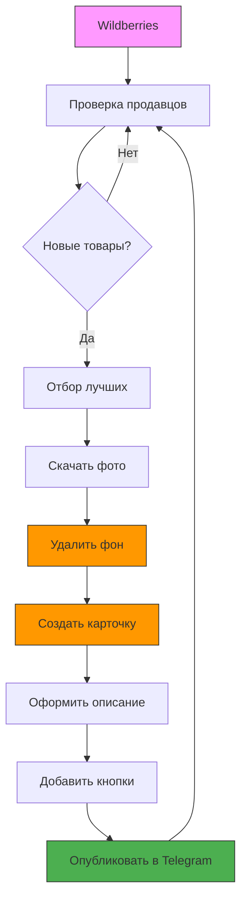

# Дорожная карта развития платформы автоматизации контента

## Текущее состояние (MVP)

```
Wildberries ──> Проверка продавцов ──> Отбор товаров ──> Публикация в Telegram
      ✅                  ✅                  ✅                    ✅
```

### Что уже работает:
- ✅ Парсинг каталога продавца через Playwright
- ✅ Получение детальной информации о товаре
- ✅ Отбор товаров по рейтингу, отзывам, цене
- ✅ Отслеживание новых товаров (кэш)
- ✅ База данных продавцов и опубликованных товаров
- ✅ Форматирование поста с эмодзи и ценами
- ✅ Кнопки со ссылками на товары
- ✅ Публикация в Telegram

---

## Этап 1: Обработка изображений

### 1.1 Скачивание фотографий товара
**Файл:** [`image/downloader.py`](image/downloader.py) — ✅ уже реализован

### 1.2 Удаление фона
**Файл:** [`image/background_remover.py`](image/background_remover.py) — ❌ пустой

**Задача:** Реализовать автоматическое удаление фона с фотографий товаров.

**Варианты реализации:**
- **rembg** — бесплатная локальная библиотека на базе ИИ
- **remove.bg API** — платный, но более качественный
- **PIL + пороговая обработка** — для простых случаев

**Пример кода:**
```python
# image/background_remover.py
from rembg import remove
from PIL import Image

class BackgroundRemover:
    def remove(self, input_path: str, output_path: str):
        with open(input_path, "rb") as f:
            input_data = f.read()
        output_data = remove(input_data)
        with open(output_path, "wb") as f:
            f.write(output_data)
```

### 1.3 Создание фирменной карточки товара
**Файл:** [`image/template.py`](image/template.py) — ❌ пустой

**Задача:** Наложение товара на фирменный шаблон канала.

**Что должно быть:**
- Фоновый шаблон (градиент, паттерн)
- Логотип/название канала
- Фотография товара с удалённым фоном
- Цена товара крупно
- Название категории
- Бренд

**Пример:**
```python
# image/template.py
from PIL import Image, ImageDraw, ImageFont

class CardRenderer:
    def render(self, product, photo_path: str, output_path: str):
        # 1. Загружаем шаблон
        # 2. Вставляем фото товара
        # 3. Добавляем текст (цена, бренд, категория)
        # 4. Сохраняем результат
        pass
```

### 1.4 Сборка финального изображения
**Файл:** [`image/renderer.py`](image/renderer.py) — ❌ пустой

**Задача:** Оркестрация всего процесса обработки изображения:
1. Скачать фото → 2. Удалить фон → 3. Наложить на шаблон → 4. Сохранить

---

## Этап 2: Улучшение публикаций

### 2.1 Публикация с фотографией
**Файл:** [`telegram/publisher.py`](telegram/publisher.py)

Сейчас публикация идёт без фото (только текст). Нужно:
1. Создать карточку товара
2. Отправить её как фото с подписью через `send_photo`

### 2.2 Несколько товаров в одном посте
Сейчас публикуется 2 товара за раз. В будущем можно:
- Публиковать карусель из фото
- Делать отдельный пост на каждый товар
- Группировать по категориям

---

## Этап 3: Расширение функциональности

### 3.1 Расписание публикаций
**Новый модуль:** `scheduler/`

- Публикация по расписанию (например, 3 раза в день)
- Настройка интервалов через конфиг
- Пропуск дублей

### 3.2 Несколько каналов
- Поддержка нескольких Telegram-каналов
- Разные тематики для разных каналов
- Разные шаблоны оформления

### 3.3 Статистика и аналитика
**Новый модуль:** `analytics/`

- Сколько товаров опубликовано
- Какие категории самые популярные
- Какие продавцы самые активные
- Динамика публикаций

### 3.4 Веб-интерфейс
**Новый модуль:** `web/`

- Дашборд с статистикой
- Управление продавцами через UI
- Просмотр истории публикаций
- Настройка параметров отбора

---

## Этап 4: Масштабирование

### 4.1 Другие маркетплейсы
- Ozon
- Yandex Market
- Lamoda

### 4.2 Умный отбор товаров
- Анализ трендов
- Прогнозирование популярности
- Автоматическое определение лучших товаров

### 4.3 Автоматическое создание контента
- Генерация уникальных описаний через ИИ
- Автоматический подбор хештегов
- A/B тестирование разных форматов постов

---

## Диаграмма полного цикла



---

## Приоритеты реализации

| Приоритет | Задача | Сложность | Влияние |
|-----------|--------|-----------|---------|
| 🔴 P0 | Удаление фона (background_remover.py) | Средняя | Высокое |
| 🔴 P0 | Шаблон карточки (template.py) | Средняя | Высокое |
| 🔴 P0 | Сборка изображения (renderer.py) | Средняя | Высокое |
| 🟡 P1 | Публикация с фото в Telegram | Низкая | Высокое |
| 🟡 P1 | Расписание публикаций | Средняя | Среднее |
| 🟢 P2 | Несколько каналов | Средняя | Среднее |
| 🟢 P2 | Статистика | Высокая | Низкое |
| 🔵 P3 | Веб-интерфейс | Высокая | Среднее |
| 🔵 P3 | Другие маркетплейсы | Очень высокая | Высокое |